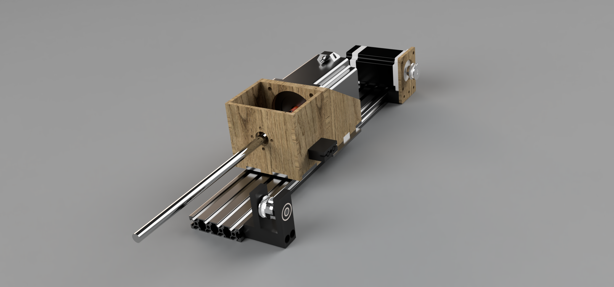
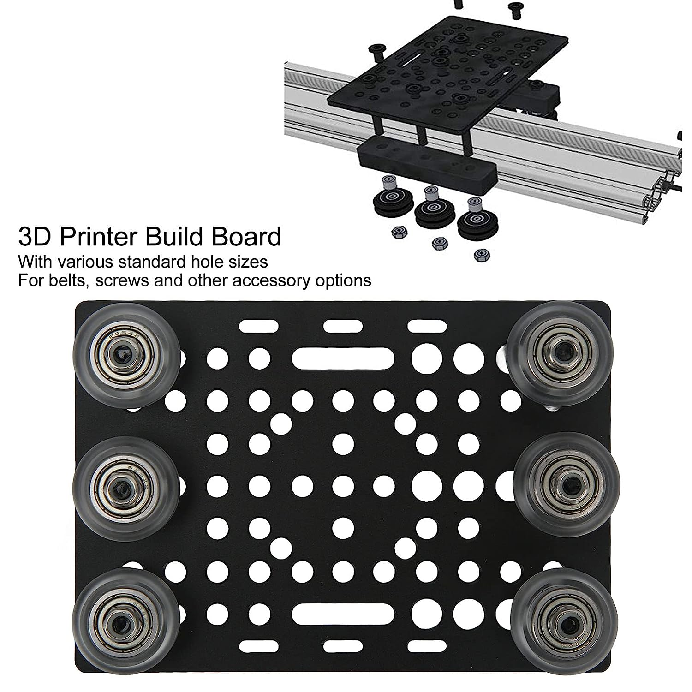
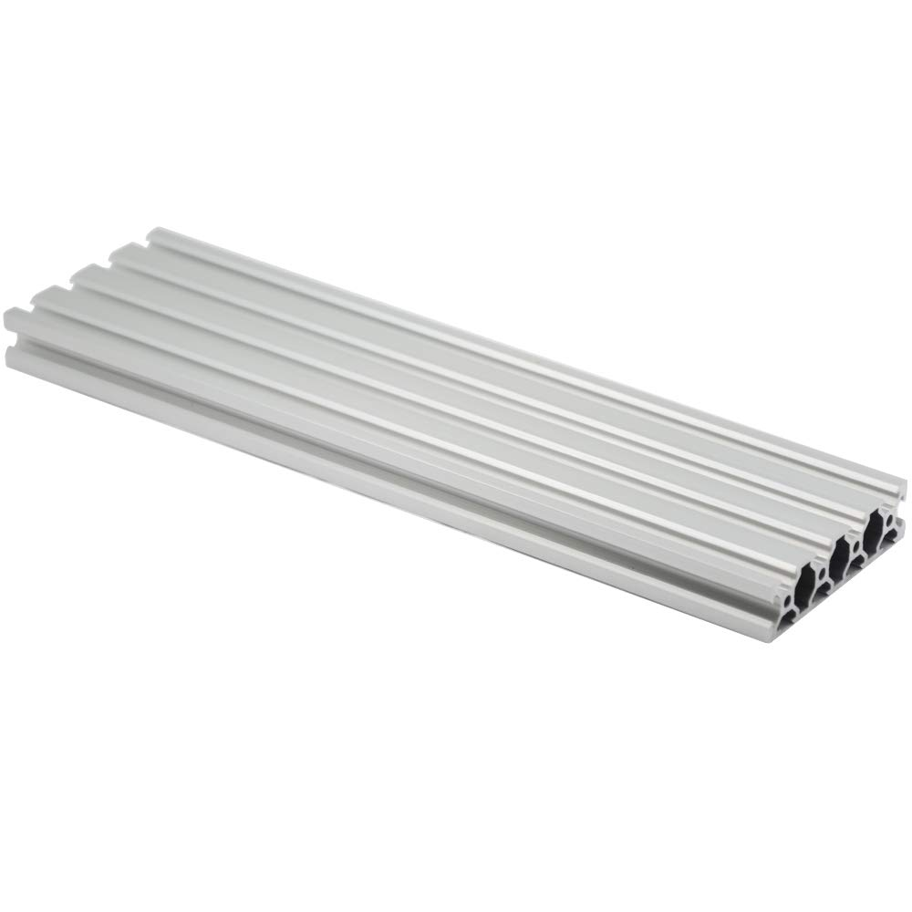

# DIY VPForce FFB Yoke
This will be a flight control yoke based on the VPForce Force Feedback Motor System. It's not finished, it's barely started. Use any files here at risk of life and liberty!

This can be used as a standard Cessna / Piper style yoke or also easily adapted to use the Cirrus style side yoke. The only difference will be what you attach to the shaft coming out of the device and where you mount it. I think Cirrus drivers will love it.

It's core will be a section of 8020 aluminum extrusion linear rail. 
The roll axis will be direct drive from an 86BLF04 VPForce motor. A honeycomb alpha yoke will be donating it's controls. I hope to use a shift register to have the yoke talk to the VPForce USB interface. 

The pitch axis will be belt or rack and pinion driven from a 57BLF03 VPForce motor. This is TBD since I very  much want this to be as smooth as possible without sacrificing torque. First tests will be standard 2GT-2mm timing belt just like an Ender 3 X-Axis movement. 2nd tests will be 3GT-3mm endless belt. 3rd Test will be rack and pinion using 3D printed gears. The objective is smooth motion (don't want to waste the anti-cogging that is so well implimented by VPForce). All tests will likely utilize the inertia feature in the VPForce software to give smooth pitch motion.

 

The above box houses the 86BLF04 motor and a shaft coupler to attach the 12mm shaft through a LM12UU linear bearing. This laser cut box will bolt to an aluminum gantry plate and ride along a section of 8020x400mm rail. Here is a link to the rail: https://a.co/d/cz4xqeC 

The gantry plate also came from Amazon but you can cut one out along with the other parts. https://a.co/d/fDJAr2g .
I eventually plan to merge the gantry plate and the bottom of the motor mounting box into one piece. However the width of the 86BLF04 motor matches very well with the location of the holes for the bolts that hold the wheels so I decided to tackle that problem in V2. V1 will require the gantry plate and the motor mount box will just bolt to the gantry plate. 

This is the 8020 rail: 

This project is just getting started, more to come shortly. 
