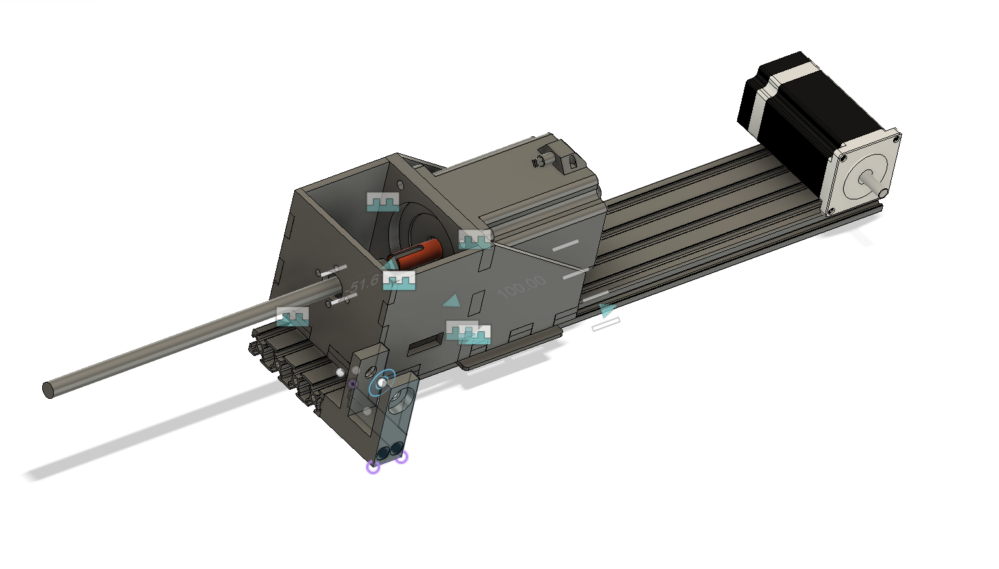

# DIY_VPForce_FFB_Yoke
This will be a flight control yoke based on the VPForce Force Feedback Motor System

It's core will ride on a section of 8020 aluminum extrusion linear rail. 
The roll axis will be direct drive from an 86BLF04 VPForce motor. A honeycomb alpha yoke will be donating it's controls. I hope to use a shift register to have the yoke talk to the VPForce USB interface. 

The pitch axis will be belt or rack and pinion driven from a 57BLF04 VPForce motor.

 

The above box will bolt to an aluminum gantry plate and ride along a section of 8020x400mm rail. Here is a link to the rail but these are universal and any vendor of the 4x wide 20 series aluminum vslot extrusion should work the same. https://a.co/d/cz4xqeC

The gantry plate came from Amazon but you can cut one out along with the other parts. https://a.co/d/fDJAr2g . The important part is that the holes have provisions for 7mm essentric nuts that allow fine tuning of the alignment of the wheels to the rail.

This project is just getting started, more to come shortly. 
